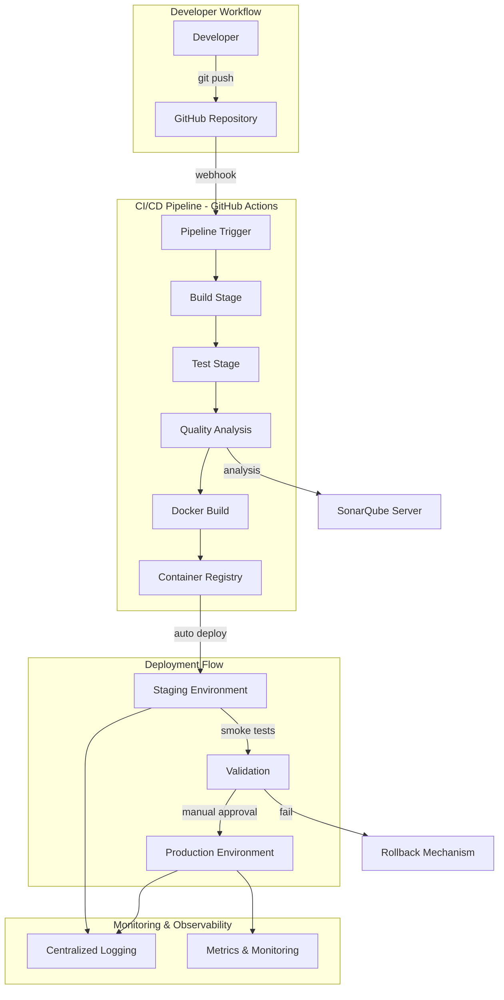

# Design Document: FlyTrack DevOps Implementation

## Overview

FlyTrack es una aplicación web backend desarrollada con Spring Boot 3.x y Java 21 que proporciona servicios REST para la gestión de vuelos, pasajeros, check-in, generación de códigos QR dinámicos, notificaciones en tiempo real y reportes de equipaje. Este diseño se enfoca en la implementación de una metodología DevOps completa que incluye:

- **Pipeline CI/CD automatizado** con GitHub Actions
- **Contenedorización** con Docker
- **Despliegue multi-entorno** (dev, staging, production)
- **Análisis de calidad** con SonarQube
- **Pruebas automatizadas** (unitarias, integración, E2E)
- **Monitoreo y logging** centralizado
- **Seguridad** con JWT y secrets management

### Design Goals

1. **Automatización completa**: Desde commit hasta producción sin intervención manual (excepto aprobación de producción)
2. **Calidad garantizada**: Quality gates que aseguran cobertura >80%, cero vulnerabilidades críticas
3. **Despliegue seguro**: Blue-green deployment con rollback automático
4. **Observabilidad**: Logs estructurados, métricas y trazabilidad completa
5. **Reproducibilidad**: Builds determinísticos y entornos consistentes vía Docker

## Architecture

### High-Level Architecture



### Application Architecture (Spring Boot Backend)

```mermaid
graph TB
    subgraph "External Clients"
        WEB[Web Frontend]
        MOBILE[Mobile App]
    